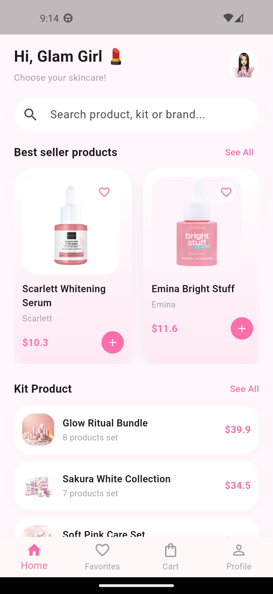
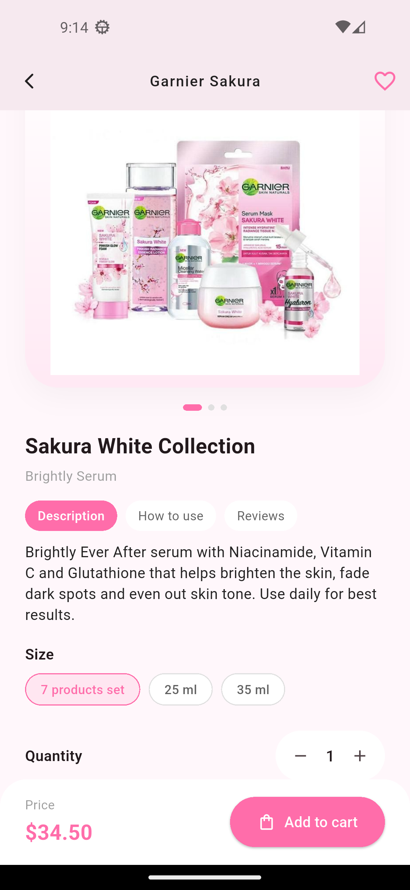
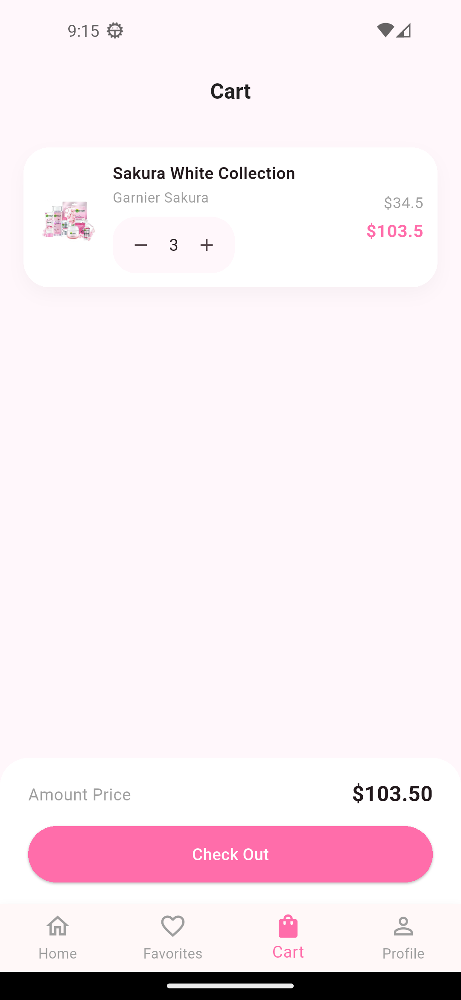
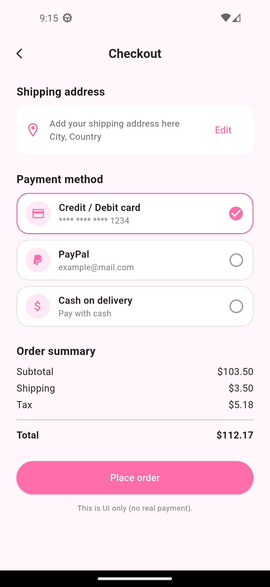

# 💄 GlamShop - Flutter E-Commerce UI

## 📱 About The Project
GlamShop is a modern **UI-focused mobile shopping application** designed for makeup and beauty products.

This project showcases clean UI design, smooth navigation flow, and modern e-commerce layouts built using Flutter.

⚠️ Note: This project currently focuses on **UI/UX implementation only** (no backend integration yet).

---

## 🎥 App Demo

---

## 🎨 Design Goal
The UI focuses on feminine aesthetics, clean layouts, and smooth shopping flow to provide a modern shopping experience.

---

## 🎨 UI Features
- ✨ Modern & Elegant Makeup Shopping Design
- 🏠 Home Screen with Product Listings
- 🔍 Product Details Screen
- ❤️ Favorites Screen
- 🛒 Shopping Cart UI
- 👤 Profile Screen
- 🔐 Login & Signup Screens
- 📱 Responsive Layouts
- ⚡ Smooth UI Animations

---

## 🧠 Architecture Approach
The UI was built with a scalable structure in mind to allow easy future integration with backend APIs, state management, and real data sources.

---

## 🛠️ Built With
- Flutter
- Dart
- Material Design
- Custom UI Components

---

## 📸 Screenshots

---
## 📂 Project Structure
lib/
│
├── main.dart
├── splash_screen.dart
├── home_screen.dart
├── product_details_screen.dart
├── cart_screen.dart
├── favorite_screen.dart
├── login_screen.dart
├── signup_screen.dart
└── profile_screen.dart

---
## 🚀 Getting Started

### 1️⃣ Clone the repository
git clone https://github.com/your-username/glamshop-flutter-app.git

### 2️⃣ Install dependencies
flutter pub get 

### 3️⃣ Run the app 
flutter run 

---

## 👩‍💻 Developer
Designed & developed using Flutter to demonstrate modern mobile UI design skills.

---

## 🔮 Future Improvements
- API Integration
- Firebase Authentication
- Real Product Data
- Payment Integration
- State Management Architecture